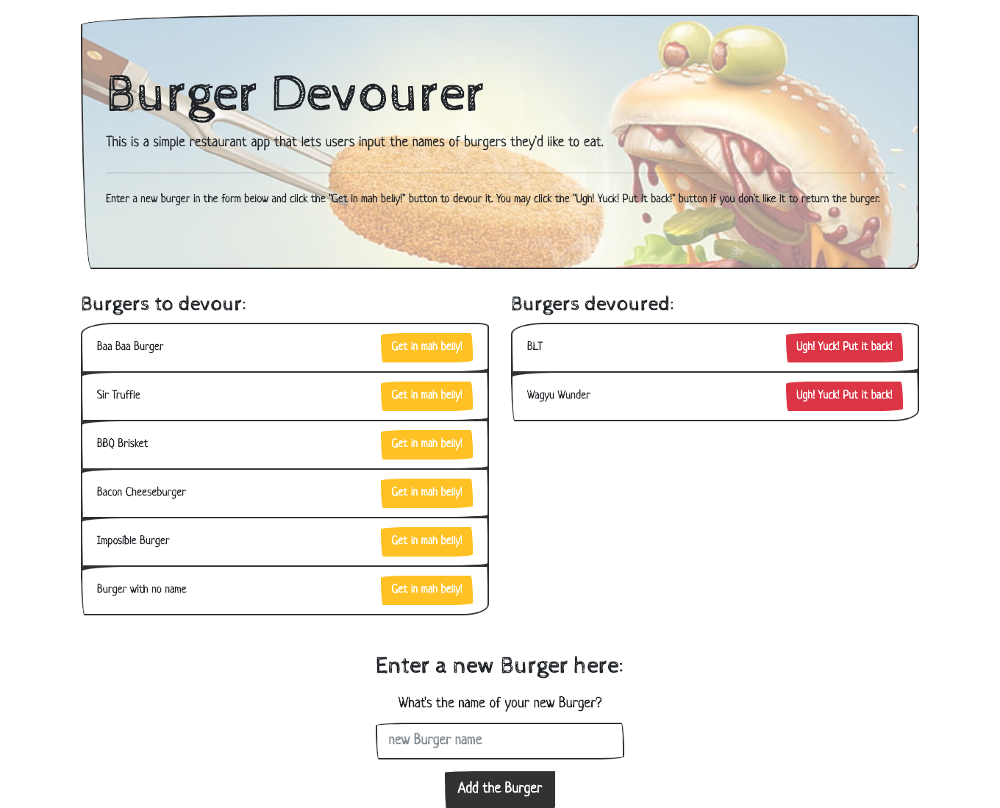

# Burger Devourer
  

## Description
This is a simple restaurant app created using Node, Express, Handlebars, ORM technique and MySQL npm that lets users input the names of burgers they'd like to eat. 

## Table of Contents
1. [Installation](#Installation)
2. [Usage](#Usage)
3. [License](#License)
4. [Contributing](#Contributing)
5. [Test](#Test)
6. [Questions](#Questions)

### Installation
1. Clone repo  2. Install `dependencies` by running `npm i` in your terminal.  3. Execute `burgers_db.sql` & `seeds.sql` in your MySQL Workbench.  5. Create a `.env` file and type in `PASSWORD=your_mysql_server_password`.  6. Back in your terminal, run `npm start`.  Note: Make sure you have node.js installed in you machine, otherwise head to https://nodejs.org/en/download/ . You also you need to have MySQL Workbench & MySQL Server installed first. 
Alternatively, click the deployed link under **Usage**.

### Usage
Deployed URL: https://burger-glutton-app.herokuapp.com/ 
Enter a new burger name in the form. Click the "Get in mah belly!" button to devour it. Then, you may click the "Ugh! Yuck! Put it back!" button if you don't like it to return the burger.

**ScreenHere's a static image of the app screen:**  
  

### License
Copyright (c) 2012 Rommel Jay San Jose (GitHub profile name: arjaesj)  
Licensed under the ISC license.

### Contributing
Please feel free to for & clone the repo and add/refactor the source code. Create a pull request for my review @ https://github.com/arjaesj/Burger-Devourer/compare and I'll review your code at the earliest chance I get. Thank you in advance for your contribution!

### Test
n/a

### Questions
Any questions regarding this project, please don't hesitate to contact me:  
Email me @ arjae.sj@gmail.com  
My GitHub profile page: https://github.com/arjaesj  

